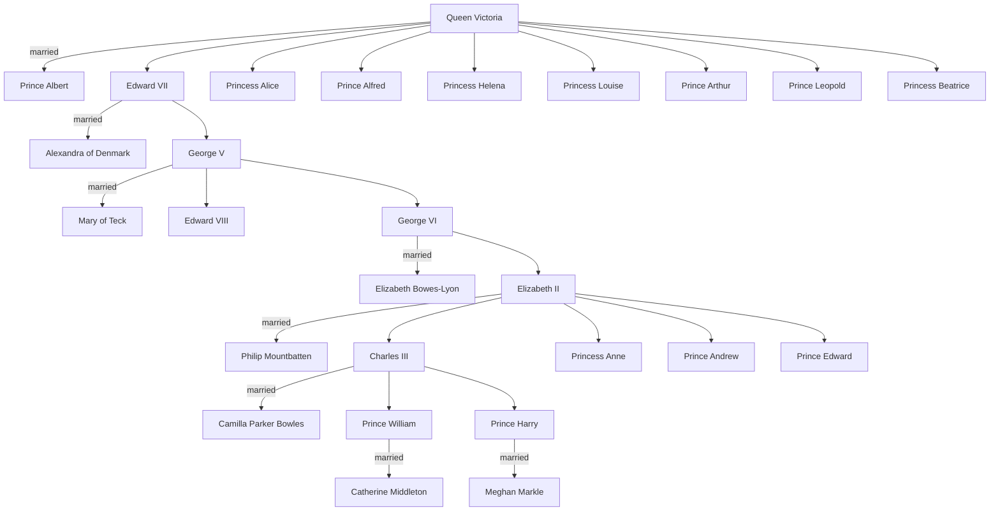
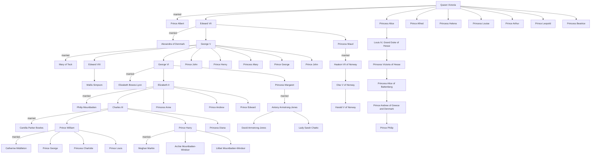

# British Royal Family

```mermaid
graph TD
    A[Queen Victoria] -->|married| B[Prince Albert]
    A --> C[Edward VII]
    A --> D[Princess Alice]
    A --> E[Prince Alfred]
    A --> F[Princess Helena]
    A --> G[Princess Louise]
    A --> H[Prince Arthur]
    A --> I[Prince Leopold]
    A --> J[Princess Beatrice]
    C -->|married| K[Alexandra of Denmark]
    C --> L[George V]
    L -->|married| M[Mary of Teck]
    L --> N[Edward VIII]
    L --> O[George VI]
    O -->|married| P[Elizabeth Bowes-Lyon]
    O --> Q[Elizabeth II]
    Q -->|married| R[Philip Mountbatten]
    Q --> S[Charles III]
    Q --> T[Princess Anne]
    Q --> U[Prince Andrew]
    Q --> V[Prince Edward]
    S -->|married| W[Camilla Parker Bowles]
    S --> X[Prince William]
    S --> Y[Prince Harry]
    X -->|married| Z[Catherine Middleton]
    Y -->|married| AA[Meghan Markle]
```

## Extended

```mermaid
graph TD
    A[Queen Victoria] -->|married| B[Prince Albert]
    A --> C[Edward VII]
    A --> D[Princess Alice]
    A --> E[Prince Alfred]
    A --> F[Princess Helena]
    A --> G[Princess Louise]
    A --> H[Prince Arthur]
    A --> I[Prince Leopold]
    A --> J[Princess Beatrice]
    C -->|married| K[Alexandra of Denmark]
    C --> L[George V]
    L -->|married| M[Mary of Teck]
    L --> N[Edward VIII]
    L --> O[George VI]
    O -->|married| P[Elizabeth Bowes-Lyon]
    O --> Q[Elizabeth II]
    Q -->|married| R[Philip Mountbatten]
    Q --> S[Charles III]
    Q --> T[Princess Anne]
    Q --> U[Prince Andrew]
    Q --> V[Prince Edward]
    S -->|married| W[Camilla Parker Bowles]
    S --> X[Prince William]
    S --> Y[Prince Harry]
    X -->|married| Z[Catherine Middleton]
    Y -->|married| AA[Meghan Markle]
    N --> BB[Wallis Simpson]
    O --> CC[Princess Margaret]
    CC -->|married| DD[Antony Armstrong-Jones]
    DD --> EE[David Armstrong-Jones]
    DD --> FF[Lady Sarah Chatto]
    S --> GG[Princess Diana]
    X --> HH[Prince George]
    X --> II[Princess Charlotte]
    X --> JJ[Prince Louis]
    Y --> KK[Archie Mountbatten-Windsor]
    Y --> LL[Lilibet Mountbatten-Windsor]
    L --> MM[Prince John]
    L --> NN[Prince Henry]
    L --> OO[Princess Mary]
    L --> PP[Prince George]
    L --> QQ[Prince John]
    C --> RR[Princess Maud]
    RR -->|married| SS[Haakon VII of Norway]
    SS --> TT[Olav V of Norway]
    TT --> UU[Harald V of Norway]
    D --> VV[Louis IV, Grand Duke of Hesse]
    VV --> WW[Princess Victoria of Hesse]
    WW --> XX[Princess Alice of Battenberg]
    XX --> YY[Prince Andrew of Greece and Denmark]
    YY --> ZZ[Prince Philip]
```

## Extended Again

```mermaid
graph TD
    A[Queen Victoria] -->|married| B[Prince Albert]
    A --> C[Edward VII]
    A --> D[Princess Alice]
    A --> E[Prince Alfred]
    A --> F[Princess Helena]
    A --> G[Princess Louise]
    A --> H[Prince Arthur]
    A --> I[Prince Leopold]
    A --> J[Princess Beatrice]
    C -->|married| K[Alexandra of Denmark]
    C --> L[George V]
    L -->|married| M[Mary of Teck]
    L --> N[Edward VIII]
    L --> O[George VI]
    O -->|married| P[Elizabeth Bowes-Lyon]
    O --> Q[Elizabeth II]
    Q -->|married| R[Philip Mountbatten]
    Q --> S[Charles III]
    Q --> T[Princess Anne]
    Q --> U[Prince Andrew]
    Q --> V[Prince Edward]
    S -->|married| W[Camilla Parker Bowles]
    S --> X[Prince William]
    S --> Y[Prince Harry]
    X -->|married| Z[Catherine Middleton]
    Y -->|married| AA[Meghan Markle]
    N --> BB[Wallis Simpson]
    O --> CC[Princess Margaret]
    CC -->|married| DD[Antony Armstrong-Jones]
    DD --> EE[David Armstrong-Jones]
    DD --> FF[Lady Sarah Chatto]
    S --> GG[Princess Diana]
    X --> HH[Prince George]
    X --> II[Princess Charlotte]
    X --> JJ[Prince Louis]
    Y --> KK[Archie Mountbatten-Windsor]
    Y --> LL[Lilibet Mountbatten-Windsor]
    L --> MM[Prince John]
    L --> NN[Prince Henry]
    L --> OO[Princess Mary]
    L --> PP[Prince George]
    L --> QQ[Prince John]
    C --> RR[Princess Maud]
    RR -->|married| SS[Haakon VII of Norway]
    SS --> TT[Olav V of Norway]
    TT --> UU[Harald V of Norway]
    D --> VV[Louis IV, Grand Duke of Hesse]
    VV --> WW[Princess Victoria of Hesse]
    WW --> XX[Princess Alice of Battenberg]
    XX --> YY[Prince Andrew of Greece and Denmark]
    YY --> ZZ[Prince Philip]
    A --> AAA[Prince Ernest Augustus]
    AAA -->|married| BBB[Princess Thyra of Denmark]
    AAA --> CCC[Princess Frederica]
    CCC -->|married| DDD[Paul I of Greece]
    DDD --> EEE[Constantine II of Greece]
    EEE -->|married| FFF[Anne-Marie of Denmark]
    FFF --> GGG[Alexia of Greece and Denmark]
    FFF --> HHH[Pavlos, Crown Prince of Greece]
    FFF --> III[Nikolaos of Greece and Denmark]
    FFF --> JJJ[Theodora of Greece and Denmark]
    FFF --> KKK[Philippos of Greece and Denmark]
```