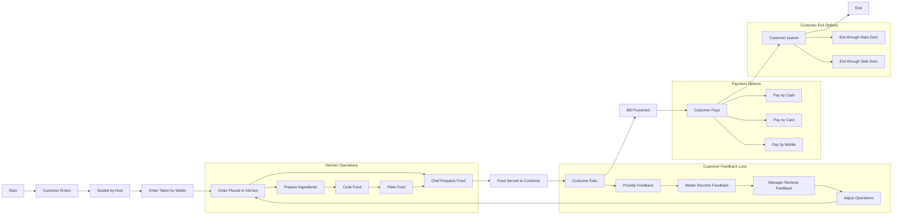
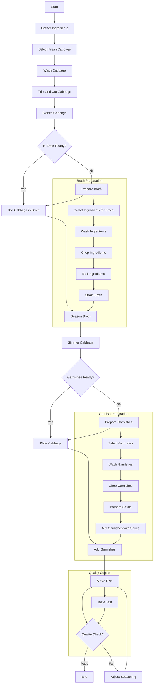
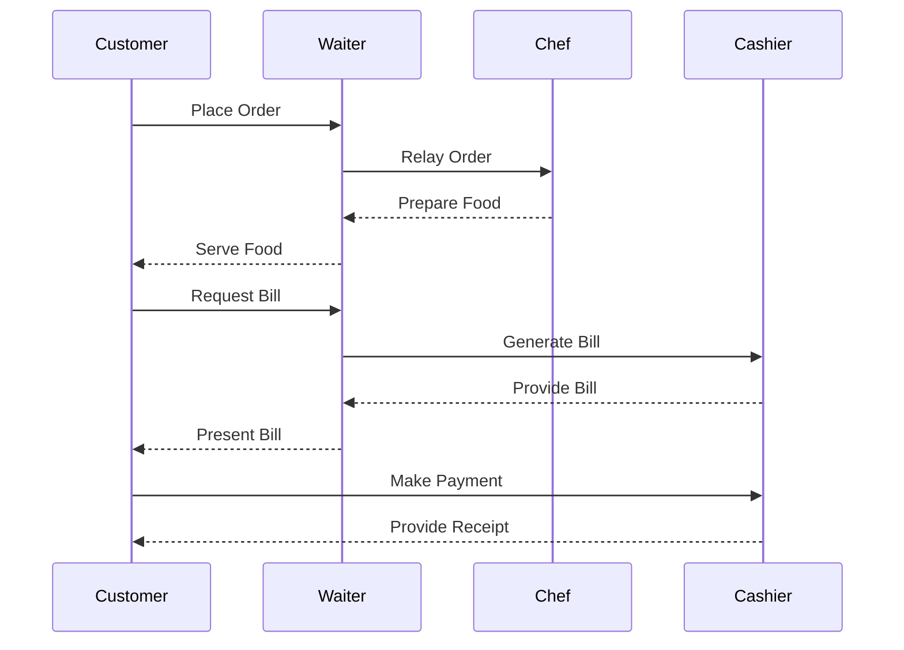
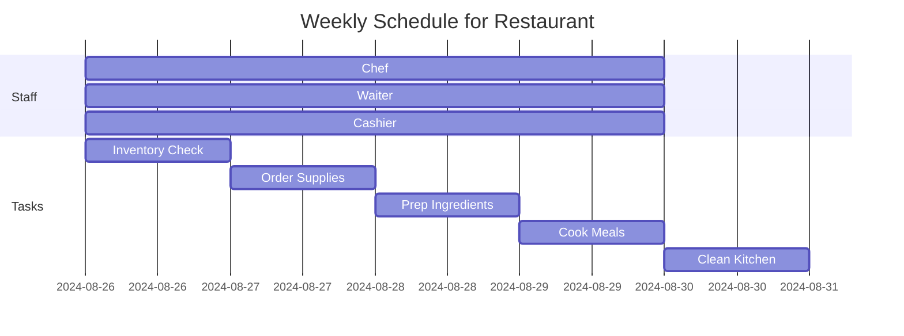

# Restaurant Operations and Cooking Recipes

In this article, we'll explore the operations of a restaurant and the process of cooking recipes using various diagrams. We'll use Mermaid to create a horizontal flow chart, a vertical flow chart, a UML sequence diagram, and a Gantt chart.

## 1. Horizontal Flow Chart: Restaurant Operations

## 2. Vertical Flow Chart: Cooking a Recipe

## 3. UML Sequence Diagram: Order Process

## 4. Gantt Chart: Weekly Schedule for a Restaurant

