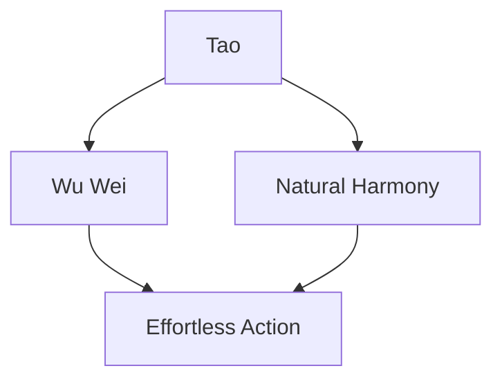

# Exploring the Tao Te Ching

This document delves into the timeless wisdom of the Tao Te Ching, subtly demonstrating the capabilities of GitHub Flavored Markdown (GFM).

## Journey Through the Tao

- [x] Begin the journey
- [x] Contemplate the teachings
- [ ] Embrace the Tao
- [ ] Live in harmony

## Key Concepts

| Chapter | Theme                        | Insight             |
|:-------:|:----------------------------:|--------------------:|
| 1       | The Tao that can be told     | Beyond words        |
| 2       | The relativity of opposites  | Balance             |
| 3       | Non-action (Wu Wei)          | Effortless action   |

## Reflective Code

```python
def tao_te_ching():
    return "Embrace simplicity and harmony."
```

## Deeper Understanding

The Tao Te Ching emphasizes the concept of **Wu Wei** (non-action).

: Wu Wei is about aligning with the natural flow of life.

## Evolving Interpretations

~~This view is rigid~~ Embrace fluidity in understanding.

## Symbols of Wisdom

:yin_yang: :leaves: :mountain:

## Flow of Wisdom



---

This exploration subtly integrates GFM features while reflecting on the profound teachings of the Tao Te Ching.
